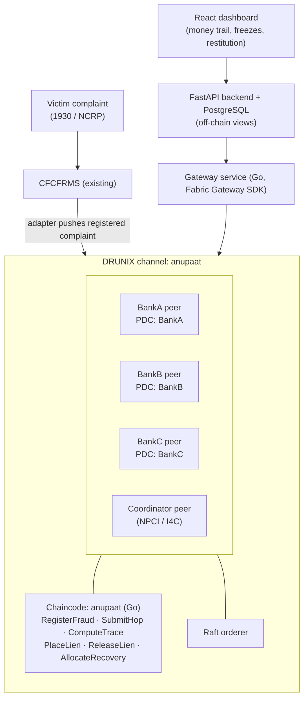
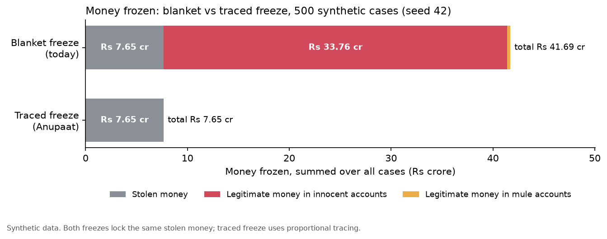

# Anupaat

**Proportional Freeze and Fair Restitution for UPI Fraud on DRUNIX**

Anupaat (अनुपात, "proportion") freezes only the stolen money, not the whole account, and returns recovered money to victims in proportion to their losses.

Proposal for the Drunix Hackathon (India Blockchain Forum, NPCI and Citi, challenge CHL-7007). Tracks: Real-Time Payments (primary), Innovative Fintech Ideas (secondary).

Author: Dhanush (DK19)

---

## Status

**Proposal stage.** This repo contains the reference tracing logic and the simulation. The DRUNIX chaincode is planned for the build phase. **All data in this repo is synthetic.**

---

## The problem

A victim loses ₹50,000 on UPI. The fraudster moves it through several accounts at different banks. Some are mule accounts. One is a shop owner who received ₹4,000 of it as an ordinary payment.

Today, banks usually freeze the **entire** balance of every account the money touched. The shop owner loses access to ₹2 lakh of savings over ₹4,000 that was never their fault. When one mule account holds money from five victims, each bank works out on its own who is owed what, because no bank can see the whole money trail.

What is already known:

- **CFCFRMS** (run by I4C under MHA, fed by the 1930 helpline and the NCRP portal) is the existing complaint-to-bank freeze system. As of 30 June 2026 it had saved over ₹11,158 crore across 32.80 lakh complaints and onboarded 1,586 entities.
- **CFCFRMS 2.0 (April 2026)** added a Money Restoration Module and a Grievance Redressal Module for account freezes and lien markings. A dedicated module for freeze grievances shows that over-broad freezes are a real, frequent problem.
- **Karnataka High Court (2026):** when police directions specified only ₹25,000 in disputed funds, the bank could not freeze the entire account.

The speed of the first freeze is largely handled by CFCFRMS. **The precision of the freeze and the fairness of restitution are not.** The root cause is that no single bank sees the full path of the money, so nobody can compute an agreed figure for how much of each balance is actually stolen.

## The solution

Every bank records its part of the money trail on one shared DRUNIX channel. Chaincode then:

1. **Traces** the stolen money hop by hop and computes how much of each victim's money sits in each account.
2. **Freezes only that amount** (a lien equal to the traced stolen money), not the whole balance.
3. **Splits recoveries** among victims in proportion to each victim's traced share in that account.

Anupaat is a **settlement layer beneath CFCFRMS**, not a replacement. CFCFRMS stays the complaint entry point.

### How tracing works

Money is tracked in integer paise. Each account holds its own (legitimate) money plus stolen money tagged per victim. Events are replayed in time order.

- **Proportional (default):** an outgoing payment carries stolen money in the same ratio as the sender's balance.
  Example: an account holds ₹80,000 of its own money and receives ₹20,000 stolen. It then sends ₹50,000. That payment carries ₹10,000 stolen and ₹40,000 own. The sender keeps ₹40,000 own and ₹10,000 stolen.
- **FIFO:** outgoing payments use the oldest money first.
- **Full freeze:** today's practice, as a baseline. Every account that received stolen money is frozen in full.
- **Cash-outs** (withdrawals, or payments to untracked destinations) remove money from the system. That money is unrecoverable.
- **Allocation:** recovered money from an account is split among victims in proportion to their traced share there.

All splits use the largest-remainder method with a fixed tie-break (sorted victim id), so every total is exact to the paisa and the same inputs always give the same outputs. That determinism is required for chaincode: every endorsing peer must compute the same result.

Proportional tracing is a **policy choice**, not a legal rule. The mode is configurable so policymakers can compare outcomes.

## Why a ledger, and why DRUNIX

1. **Several parties must agree on one calculation that none of them can do alone.** Each bank sees only its own hop. The chaincode computes the traced amounts deterministically, and the involved banks endorse the result. That gives one binding figure instead of several spreadsheets.
2. **Privacy.** Private data collections keep account and customer identifiers inside each bank. The shared channel holds only salted hashes and amounts.
3. **Signed, tamper-evident history.** Every freeze, release and payout is signed and time-stamped. Courts, police and account holders can all check the same record.

DRUNIX is NPCI's permissioned ledger, a fork of Hyperledger Fabric compatible with HLF v2.5.x. It already provides what this needs: permissioned membership, private data collections, endorsement policies and Raft ordering.

## Architecture (planned build)



PDC = private data collection. Each bank's collection holds its raw account identifiers; the shared channel holds only salted SHA-256 hashes and amounts.

The official Fabric Gateway client SDKs are Go, Node and Java; there is no official Python SDK. So FastAPI calls a small Go gateway service over HTTP, and that service talks to the ledger.

### Planned chaincode functions

| Function | Called by | What it does |
|---|---|---|
| `RegisterFraud(caseId, victimHash, firstHop, amount, ts)` | Victim's bank | Opens a case |
| `SubmitHop(caseId, fromHash, toHash, amount, ts, type)` | Bank holding the sending account | Records a transfer, cash-out or income event. Raw identifiers go to that bank's private data collection |
| `ComputeTrace(caseId, mode)` | Coordinator | Runs the tracing algorithm and writes the traced amount per account hash |
| `PlaceLien(caseId, accountHash)` | Holding bank | Creates a lien equal to the traced amount |
| `ReleaseLien(caseId, accountHash, reason)` | Holding bank + Coordinator | Releases a lien |
| `AllocateRecovery(caseId, accountHash, amount)` | Coordinator | Splits recovered funds among victims in proportion to their traced shares |

Ledger rules:

- Lien keys use key-level endorsement: both the account-holding bank **and** the Coordinator must endorse.
- Deterministic chaincode: integer paise only, keys sorted before any iteration, transaction timestamp instead of wall-clock time, no randomness.
- The Go chaincode will be cross-checked against `reference/tracer.py` on the same simulated cases and must match to the paisa.

## Results (synthetic data)

Produced by `python -m sim.simulate --seed 42 --cases 500`. Every number below comes from `results/summary.csv` and `results/aggregate.csv`.

The run generated 500 synthetic cases: 1,501 victims, 6,504 accounts across 3 banks, of which 1,787 are innocent merchants or individuals. Each case has 1 to 5 victims and 3 to 4 layers of mule accounts, with fan-out, fan-in and cash-outs at every layer. 4,035 accounts ended up holding traced money from more than one victim, which exercises the allocation logic. Total stolen: ₹15,92,58,772.00. Of that, ₹8,27,18,950.79 was cashed out before the freeze (proportional trace) and cannot be recovered by any freeze.



| Metric (500 cases) | Blanket freeze (today) | Traced freeze (proportional) | Traced freeze (FIFO) |
|---|---:|---:|---:|
| Legitimate money frozen in innocent accounts | **₹33,75,92,590.14** | **₹0.00** | ₹0.00 |
| Innocent accounts with any freeze | 1,436 | 1,436 | 1,427 |
| Innocent accounts frozen beyond their stolen share | 1,436 | 0 | 0 |
| Legitimate money frozen, all accounts | ₹34,03,97,483.79 | ₹0.00 | ₹0.00 |
| Stolen money frozen | ₹7,65,39,821.21 | ₹7,65,39,821.21 | ₹8,23,95,849.00 |
| Stolen money frozen in innocent accounts | ₹1,46,21,670.86 | ₹1,46,21,670.86 | ₹1,79,60,731.00 |
| Total money frozen | ₹41,69,37,305.00 | ₹7,65,39,821.21 | ₹8,23,95,849.00 |
| Mean recoverable share per victim | 48.09% | 48.09% | 52.50% |

What this shows:

- **Same recovery, far less collateral damage.** The blanket freeze and the traced freeze lock exactly the same stolen money (₹7,65,39,821.21). The blanket freeze also locks ₹34,03,97,483.79 of legitimate money, ₹33,75,92,590.14 of it in innocent accounts.
- **Innocent account holders carry almost all of it.** To hold ₹1,46,21,670.86 of stolen money sitting in innocent accounts, the blanket freeze locks ₹33,75,92,590.14 of their own money, about 23 times as much. On average, each of the 1,436 affected innocent accounts held ₹10,182 of stolen money and had ₹2,35,092 of its own money frozen.
- **Under traced freezing, legitimate money frozen is zero by construction.** That is not a surprising result; it is the definition of the policy. The point is the size of the collateral damage under blanket freezing.
- **The tracing rule matters.** FIFO assumes older money is spent first. Mules' pre-fraud money is cashed out first and innocent holders' prior balances are spent first, so more stolen money is traced as still present: FIFO locks ₹8,23,95,849.00 against ₹7,65,39,821.21 for proportional, and ₹1,79,60,731.00 in innocent accounts against ₹1,46,21,670.86. Victims' mean recoverable share goes from 48.09% to 52.50%, but innocent holders carry a larger lien. This is why the mode is a configurable policy choice.

Limits of this simulation: amounts, network shapes and cash-out rates are synthetic choices, not calibrated to real fraud data. The results show the mechanism and the order of magnitude of blanket-freeze collateral damage under these assumptions, not a forecast. "Legitimate money in mule accounts" is the mules' pre-fraud balance, counted as legitimate because the tracer has no basis to call it stolen.

## How to run

Requires Python 3.11.

```bash
pip install -r requirements.txt
```

```bash
python -m pytest
```

```bash
python -m sim.simulate --seed 42 --cases 500
```

The simulator writes `results/summary.csv` (one row per case, amounts in paise), `results/aggregate.csv` (totals) and `results/innocent_money_frozen.png`. Same seed, same output.

### Repo layout

```
reference/tracer.py   tracing (proportional, fifo, full_freeze), lien, allocation, invariant checks
sim/simulate.py       synthetic case generator and blanket vs traced comparison
tests/test_tracer.py  hand-computed cases and invariant tests
results/              output of the simulation run above
```

### What the tests check

- The ₹80,000 / ₹20,000 example in proportional, FIFO and full-freeze modes.
- A two-victim split and its proportional allocation.
- A cash-out removing stolen money from the system.
- Exact paise rounding in splits and allocations.
- On simulated cases, in every mode: traced stolen money is never negative and never above the victim's loss; `loss = still in accounts + cashed out` exactly for every victim; allocation sums exactly to the recovered amount; the same inputs give identical outputs.

## Build plan (after shortlisting)

| Sprint | Output |
|---|---|
| 1 | DRUNIX network with 4 orgs (3 banks + Coordinator) running. `RegisterFraud` and `SubmitHop` with private data collections. Environment setup is the biggest risk (1–2 days). |
| 2 | `ComputeTrace`, `PlaceLien`, `ReleaseLien` in Go chaincode, cross-checked against the Python reference on 500+ simulated cases. |
| 3 | `AllocateRecovery`. Go gateway service, FastAPI API, React dashboard. |
| 4 | Benchmarks (blanket vs traced), demo hardening, pitch deck. |

Deployment: the prototype runs in Docker on one cloud VM. In a pilot, each bank runs its own peer and CFCFRMS remains the front door through an adapter. The UPI payment flow itself is untouched. If NPCI sandbox APIs are available, transaction lookups feed `SubmitHop`; otherwise the payment rail is simulated and labelled as such.

## License

MIT. See [LICENSE](LICENSE).
